# Приложение учёта заказов на Java (JDBC)
# Описание проекта
### Клиент-серверное приложение для управления заказами, разработанное в рамках итоговой аттестации по курсу Java. Проект реализует полный цикл работы с базой данных PostgreSQL через JDBC, включая миграции, CRUD-операции и транзакционное управление.

## Технологический стек
Java 17
PostgreSQL 12+
Maven для управления зависимостями
JDBC для работы с базой данных
Flyway для миграций БД
PostgreSQL Driver для подключения к БД

# Структура проекта

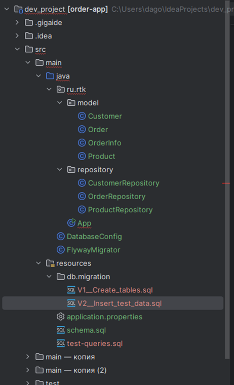

Выполненные требования задания
# Задача 1: Установка и настройка PostgreSQL
Установлена и настроена PostgreSQL 12+
Создана база данных dev
Настроено подключение через JDBC Driver
Параметры подключения вынесены в application.properties

# Задача 2: Проектирование и создание схемы БД
Реализованные таблицы:
product - товары (id, описание, цена, количество, категория)
customer - клиенты (id, имя, фамилия, телефон, email)
orders - заказы (id, product_id, customer_id, дата, количество, статус)
order_status - справочник статусов заказов

### Особенности реализации:
Первичные и внешние ключи
Ограничения NOT NULL и CHECK (цена ≥ 0, количество ≥ 0)
Индексы для оптимизации запросов
Комментарии к таблицам и полям
Автоматические миграции через Flyway
Тестовые данные (10+ записей в каждой таблице)

# Задача 3: SQL-запросы
Файл test-queries.sql содержит 15 запросов:
### Запросы на чтение (SELECT):
Список заказов за последние 7 дней с информацией о клиентах и товарах
Топ-3 самых популярных товаров
Общая стоимость заказов по клиентам
Заказы со статусом "На утверждении"
Заказы, ожидающие оплаты
Заказы с возвратом
Статистика по статусам заказов

### Запросы на изменение (UPDATE):
Обновление количества товара на складе после продажи
Изменение статуса заказа
Обновление статуса заказа на "Доставлен"
Обновление статуса заказа на "Отменен"

### Запросы на удаление (DELETE):
Удаление клиентов без заказов
Удаление заказов со статусами "Отменен" и "Возврат"

# Задача 4: Java-приложение (Maven, без Spring)
### Реализованный функционал:
Подключение к БД через JDBC
Использование DriverManager
Чтение конфигурации из application.properties
Управление соединением с автокоммитом false
Автоматические миграции Flyway
Создание структуры БД при запуске
Заполнение тестовыми данными

### Полный цикл CRUD-операций:
CREATE: Вставка новых товаров, клиентов и заказов
READ: Чтение заказов с JOIN на связанные таблицы
UPDATE: Обновление цен, количеств и статусов
DELETE: Удаление тестовых записей

### Транзакционность
Ручное управление транзакциями
Commit при успешном выполнении
Rollback при ошибках
Удобочитаемый вывод
Форматированные таблицы в консоли
Подробное логирование операций

### Запуск приложения
Предварительные требования
Установленная PostgreSQL 12+
Созданная база данных dev
Java 17 или выше
Maven 3.6+

## Настройка базы данных
Создайте базу данных dev в PostgreSQL

Настройте параметры подключения в src/main/resources/application.properties:
db.url=jdbc:postgresql://127.0.0.1:5432/dev
db.username=postgres
db.password=postgres

## Демонстрация работы
### При запуске приложение выполняет:
Подключение к БД и выполнение миграций
Демонстрацию CRUD-операций:
Создание нового товара и клиента
Формирование заказа
Вывод последних 5 заказов в виде форматированной таблицы
Обновление данных товаров
Удаление тестовых записей
Работу с транзакциями - все операции выполняются в рамках единой транзакции с возможностью отката при ошибках

### Особенности реализации
Чистая архитектура с разделением на модели, репозитории и бизнес-логику
Защита от SQL-инъекций через использование PreparedStatement
Гибкая конфигурация через properties-файлы
Автоматическое управление миграциями БД
Подробное логирование всех операций
Обработка ошибок с откатом транзакций

# Результаты выполнения
Проект полностью соответствует всем требованиям итогового задания:
Создана и настроена схема БД PostgreSQL
Реализованы сложные SQL-запросы на чтение/изменение/удаление
Разработано Java-приложение с полным CRUD функционалом
Обеспечена транзакционность и обработка ошибок
Настроено автоматическое применение миграций
Реализован удобочитаемый вывод результатов

# Скриншоты:

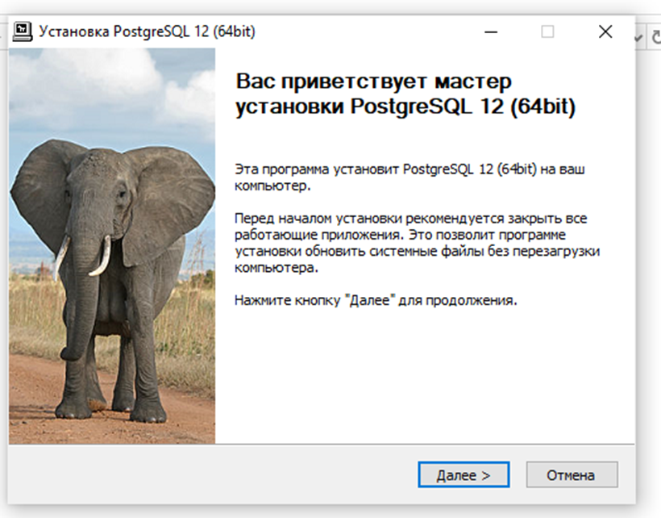
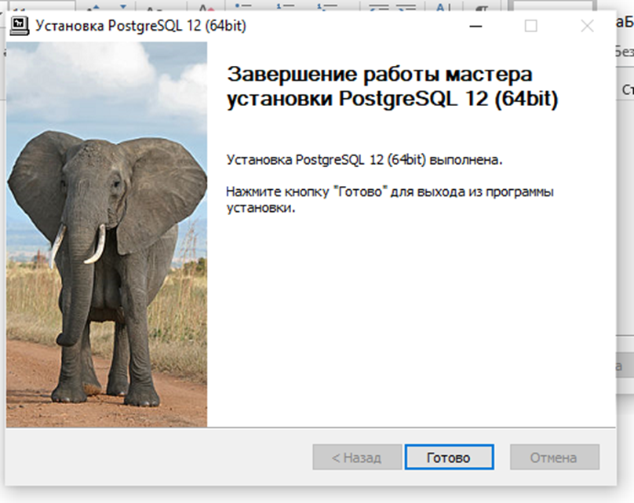
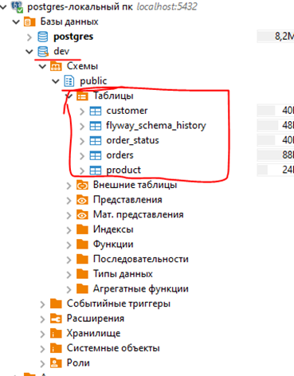
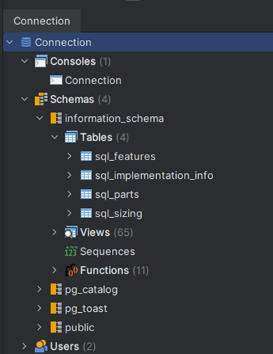
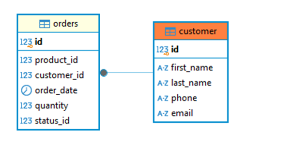
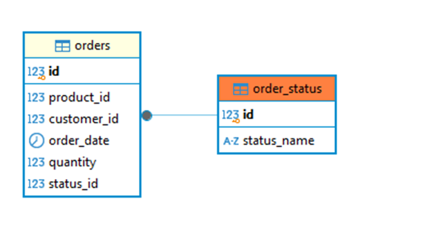
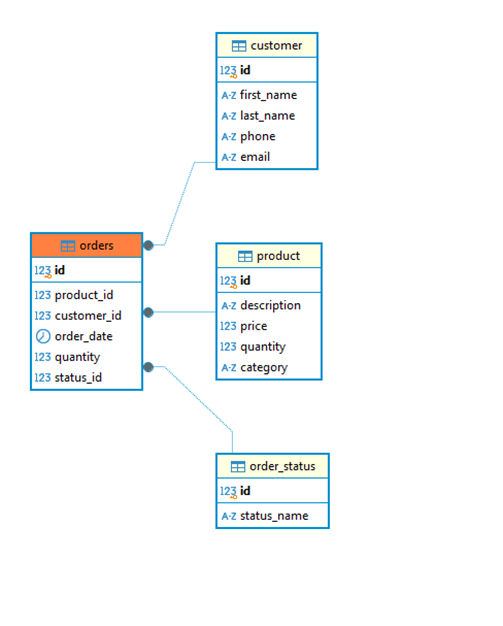
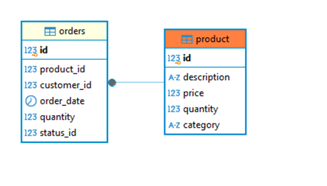
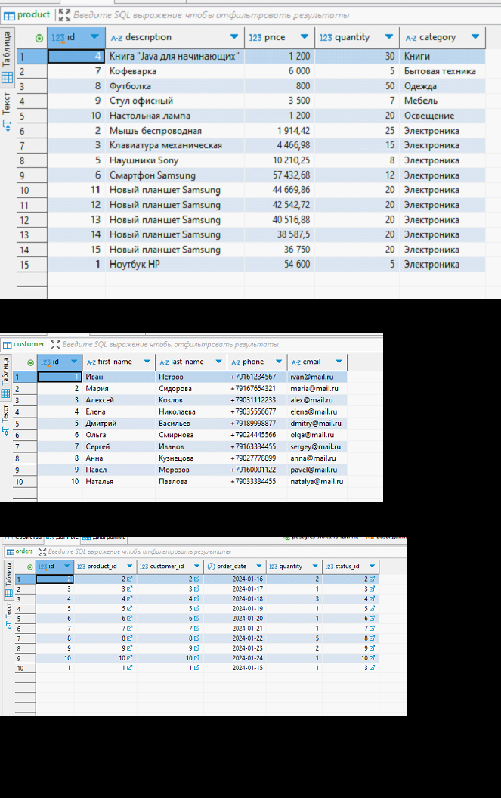
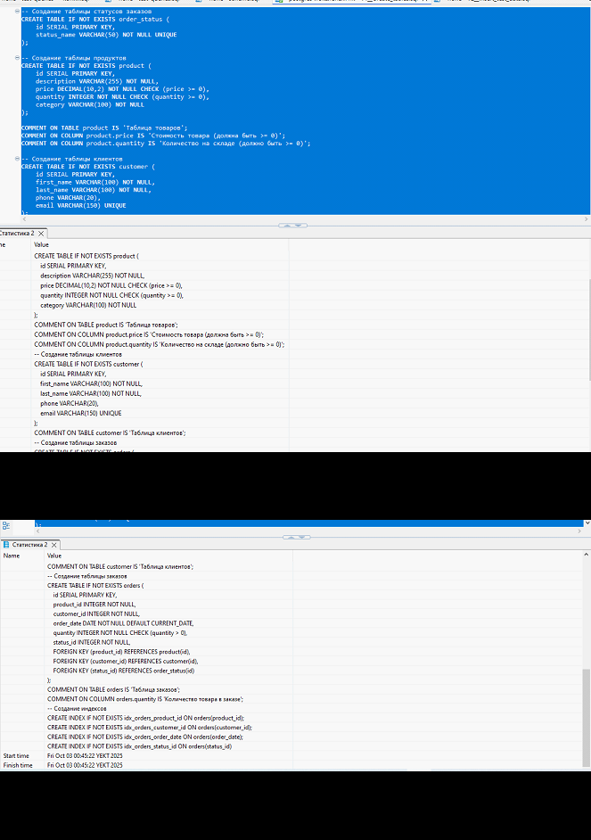

# Запуск проекта
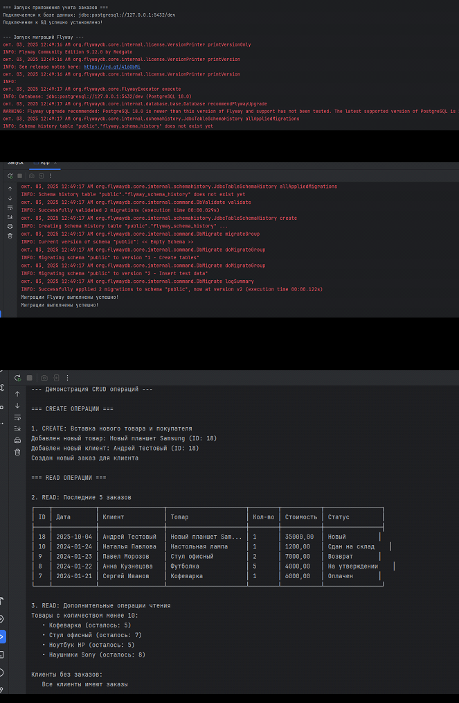